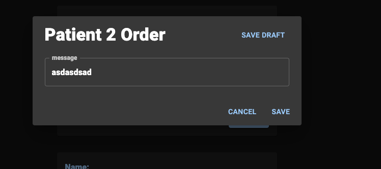
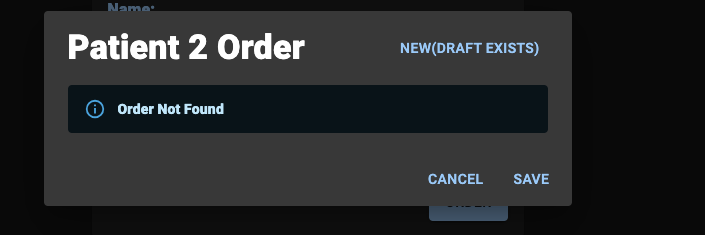
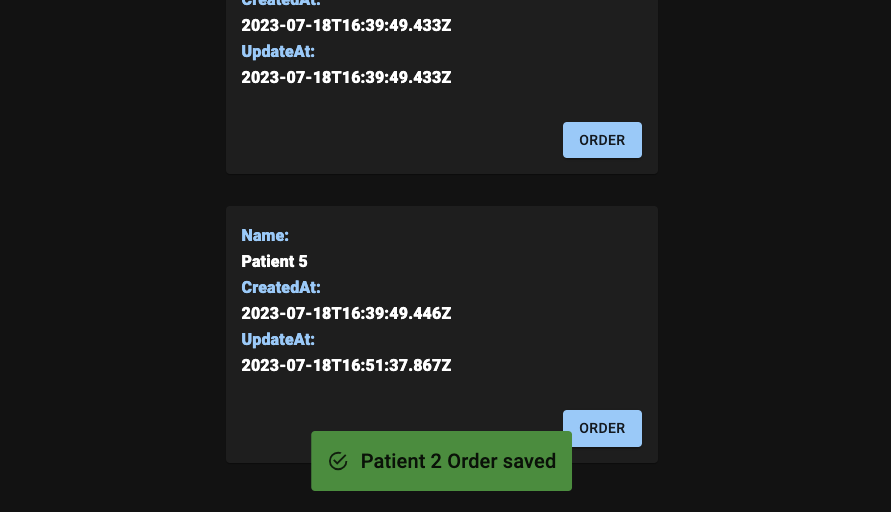
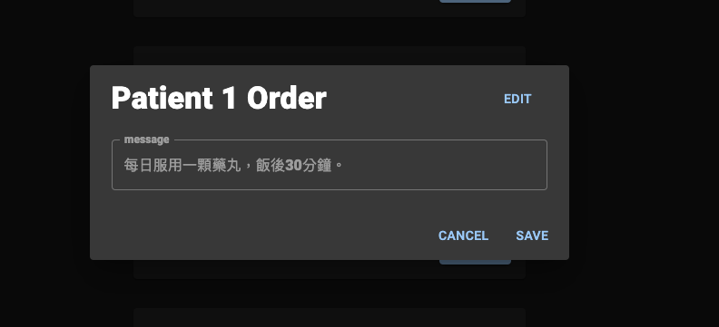
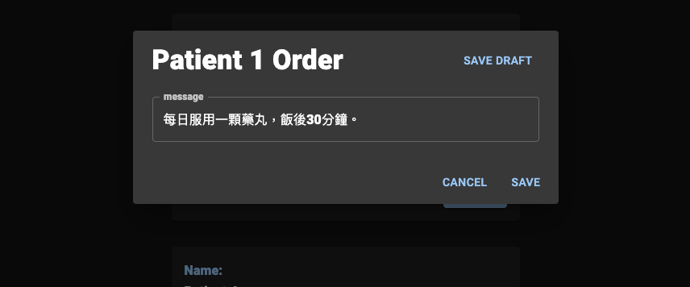
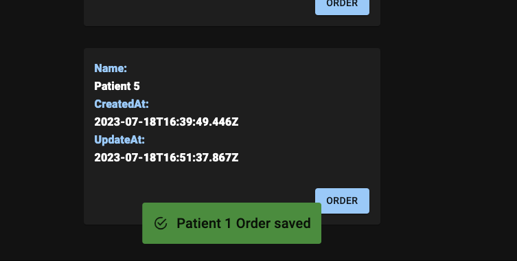

# Patient Tool

## 安裝流程

請先確保安裝以下工具/套件

- [node.js](https://nodejs.org/en/download)
- [pnpm](https://pnpm.io/installation)
- [mongoDB](https://www.mongodb.com/docs/manual/tutorial/install-mongodb-on-os-x/)

### 第一次安裝

```bash
cd patient-tool
pnpm install
```

### 運行專案

同時運行前後端:

```bash
pnpm dev:all
```

只運行前端:

```bash
pnpm dev:client
```

只運行後端:

```bash
pnpm dev:server
```

---

## 操作說明

### 列表頁

可以query到目前所有病患及他們相關的資料


點擊 `order` 即可開啟 dialog 查詢該病患的醫囑資訊

### Dialog

該病患有醫囑的情況：

無醫囑的情況：


dialog 右上角按下去即可開始編輯/新增

### 新增訂單


按右上角 `new` 開始新增流程


按右上角 `save draft`後可保存這次編輯資料

按右上角 `new(draft exists)`後讀取資料繼續編輯


新增成功

### 編輯訂單


按右上角 `edit` 開始編輯流程


按右上角 `save draft`後可保存這次編輯資料


按右上角 `edit(draft exists)`後讀取資料繼續編輯


編輯成功


